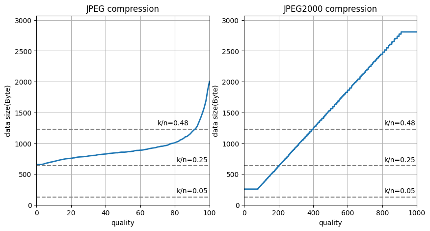

# Deep Joint Source-Channel Coding for Wireless Image Transmission

## JPEG.py, JPEG2000.py
### JPEG圧縮の考え方
#### AWGNチャネル
前提として、CIFAR-10データセット（$32\times32\times3$のRGB画像）より10000枚の画像をJPEG、またはJPEG2000方式で圧縮して送信することを考える。圧縮率は帯域圧縮率$k/n$で定義する。

任意の帯域圧縮率におけるソースサンプル当たりのビット数$`R_{\rm max}`$を以下のように定義する。
$$\displaystyle R_{\rm max}=\frac{k}{n}C\quad{\rm where}\quad C=\log_2(1+\rm SNR)$$

CIFAR-10データの各画素値は[0,255]で8bitであるので、1枚の画像のデータサイズは$32\times32\times3\times8=24,576{\rm bit}=3,072{\rm Byte}$となる。
圧縮後の画素あたりのビット数は$R_{\rm max}\rm bit$より、圧縮後のデータサイズ$S_{\rm comp}$は
$$\displaystyle S_{\rm comp}=32\times32\times3\times R_{\rm max}=3072R_{\rm max}{[\rm bit]}=\frac{3072}{8}R_{\rm max}[\rm Byte]$$
となる。


実装では、pythonのOpenCVを用いて任意のデータサイズ$S_{\rm comp}$となるように元画像を圧縮し、元画像と圧縮画像のPSNRを測定する。

### 実装
#### AWGNチャネル
OpenCVを用いて```quality```（0～100の範囲、値が小さいほど圧縮率が高い）を指定して任意の圧縮率でJPEG圧縮を行う。
```cv2.imencode('.jpg', img, [int(cv2.IMWRITE_JPEG_QUALITY), quality])```

なお、```quality```と圧縮画像のデータサイズの関係性がよくわからなかったので、全ての```quality```について一度圧縮を行い、$S_{\rm comp}$を満たす圧縮画像と元画像を比較することにした。
ちなみに```quality```と圧縮画像のデータサイズの関係性をグラフ化すると下図の通り。


なお、すべての```quality```で$S_{\rm comp}$を満たさない場合は、JPEG圧縮不可能と考え、各色チャネルの全画素を平均して画像を再構成する。このときのPSNRは15dB弱くらいになる。

## JPEG2000_s.py
JEPG2000.pyの高速処理版。