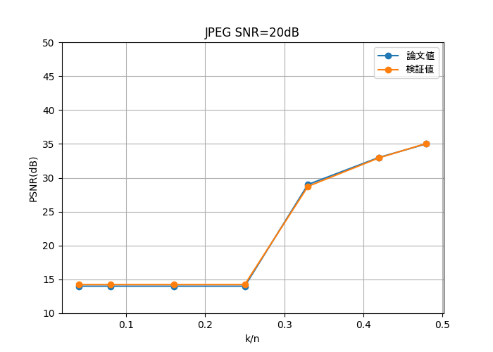

# Deep Joint Source-Channel Coding for Wireless Image Transmission
論文「[Deep Joint Source-Channel Coding for Wireless Image Transmission](https://ieeexplore.ieee.org/document/10328187)」について実装してみた。


## プログラムの説明
- JPEG.py
  JPEG圧縮
- JPEG2000.py
  JPEG2000圧縮
- JPEG2000_s.py
  JPEG2000.pyの高速処理版
- DeepJSCC_auto.py
  DeepJSCCの実行
- DeepJSCC_visualization.py
  DeepJSCCで再構成した画像の可視化

## JPEG.py JPEG2000.py
### JPEG圧縮の考え方
#### AWGNチャネル
前提として、CIFAR-10データセット（$`32\times32\times3`$のRGB画像）より10000枚の画像をJPEG、またはJPEG2000方式で圧縮して送信することを考える。圧縮率は帯域圧縮率$`k/n`$で定義する。

任意の帯域圧縮率におけるソースサンプル当たりのビット数$`R_{\rm max}`$を以下のように定義する。
$$\displaystyle R_{\rm max}=\frac{k}{n}C\quad{\rm where}\quad C=\log_2(1+\rm SNR)$$

CIFAR-10データの各画素値は[0,255]で8bitであるので、1枚の画像のデータサイズは$`32\times32\times3\times8=24,576{\rm bit}=3,072{\rm Byte}`$となる。
圧縮後の画素あたりのビット数は$`R_{\rm max}\rm bit`$より、圧縮後のデータサイズ$`S_{\rm comp}`$は
$$\displaystyle S_{\rm comp}=32\times32\times3\times R_{\rm max}=3072R_{\rm max}{[\rm bit]}=\frac{3072}{8}R_{\rm max}[\rm Byte]$$
となる。


実装では、pythonのOpenCVを用いて任意のデータサイズ$`S_{\rm comp}`$となるように元画像を圧縮し、元画像と圧縮画像のPSNRを測定する。

### 実装
#### AWGNチャネル
OpenCVを用いて```quality```（JPEG：0～100、JEPG2000：0～1000の範囲、値が小さいほど圧縮率が高い）を指定して任意の圧縮率でJPEG圧縮を行う。
JEPG：```cv2.imencode('.jpg', img, [int(cv2.IMWRITE_JPEG_QUALITY), quality])```
JPEG2000：`cv2.imencode('.jp2', img, (cv2.IMWRITE_JPEG2000_COMPRESSION_X1000, quality))`

なお、```quality```と圧縮画像のデータサイズの関係性がよくわからなかったので、全ての```quality```について一度圧縮を行い、$`S_{\rm comp}`$を満たす圧縮画像と元画像を比較することにした。ちなみに```quality```と圧縮画像のデータサイズの関係性をグラフ化すると下図の通り。なお、$`\rm SNR=20dB`$のときの$`S_{\rm comp}`$について破線で示す。


なお、すべての```quality```で$`S_{\rm comp}`$を満たさない場合は（グラフ中ではk/n=0.05のとき）、JPEG圧縮不可能と考え、各色チャネルの全画素を平均して画像を再構成する。このときのPSNRは15dB弱くらいになる。

### 結果
#### AWGNチャネル
JPEG.pyの実行結果を示す。なお、論文値については論文中のグラフから目視で読み取ったものなので目安程度に。




図を見ればわかるが、JPEG2000ではPSNRが論文値と一致しない。

### 参考
- [メモリ上への一時ファイルの作り方](https://qiita.com/mimaburao/items/26e1463feb6397197232)
- [CIFAR-10：物体カラー写真（乗り物や動物など）の画像データセット](https://atmarkit.itmedia.co.jp/ait/articles/2006/10/news021.html)
- [openCVで読み込んだ画像をmatplotlibで表示する方法](https://qiita.com/YosukeHoshi/items/189c615187f41f2f4e27)
- [PILを用いた画像圧縮(jpeg, jpeg2000)](https://jskangaroo.hatenablog.com/entry/2020/03/02/174023)
- [cv2.imwrite](https://www.codevace.com/py-opencv-save-image/)
- [OpenCVのimencodeとimdecodeでのbytesのやりとり](https://note.com/lizefield/n/nbd553366d55e)
- [OpenCV imread mode 指定](https://qiita.com/yoya/items/b2fab73698d7aa35f5a7)
- [JPEGのExif情報をとっかかりにバイナリデータと戯れる](https://beyondjapan.com/blog/2016/11/start-binary-reading-with-jpeg-exif/)
- [Python で JPG ファイルから Exif 情報を削除する](https://note.com/junf/n/n553d4a9a99c3)
- [JPEG2000詳細解説](https://www.cqpub.co.jp/hanbai/books/18/18721/18721_1syo.pdf)

## DeepJSCC_auto.py

### 参考
- [DJSCC-for-Wireless-Image-Transmission](https://github.com/irdanish11/DJSCC-for-Wireless-Image-Transmission)